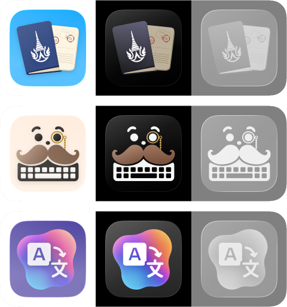

# IconComposerUI
> Render Icon Composer files in SwiftUI



## Installation

Add IconComposerUI to your Swift dependencies:
```swift
.package(url: "https://github.com/FiveSheepCo/IconComposerUI.git", .upToNextMajor(from: "0.0.1"))
```

Then add it to a target:
```swift
.target(
    name: "YourTarget",
    dependencies: [
        .product(name: "IconComposerUI", package: "IconComposerUI"),
    ]
)
```

## Usage

```swift

// Automatic appearance based on `colorScheme` environment
AppIcon(url: pathToIconFile, size: 128)

// Explicit appearance: light | dark | tinted
AppIcon(url: pathToIconFile, size: 128, appearance: .tinted)
```
